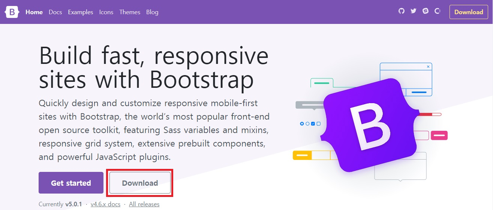

# Bootstrap

* 반응형 웹사이트를 쉽게 만들 수 있게 도와주는 HTML, CSS, JS 프레임워크
* 하나의 CSS로 휴대폰, 태블릿, 데스크탑까지 다양한 기기에서 작동
* 상업적 용도 또한 무료로 사용 가능한 오픈 소스

#### Download Link : https://getbootstrap.com/

* 위 링크에서 다운로드 가능

 

* 12 그리드 시스템 제공 - 하나의 행을 12개의 열로 나눌 수 있음
  * ex ) [bootstrap1.html](https://github.com/moonbaaang/Bootstrap/blob/main/bootstrap1.html)

