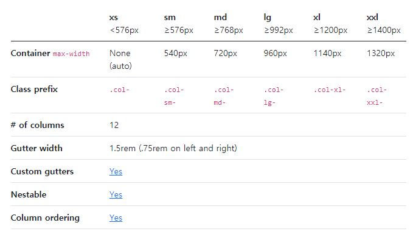
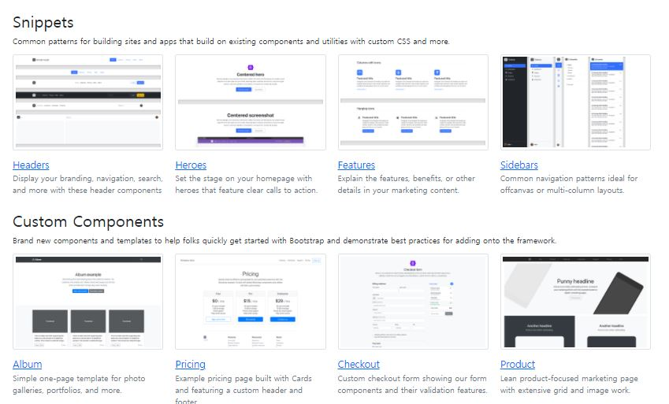
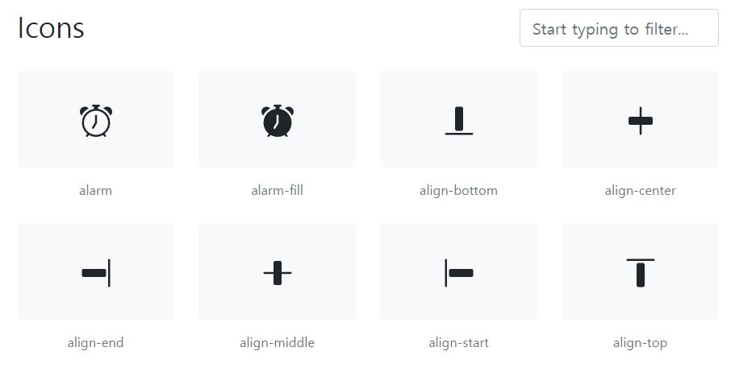
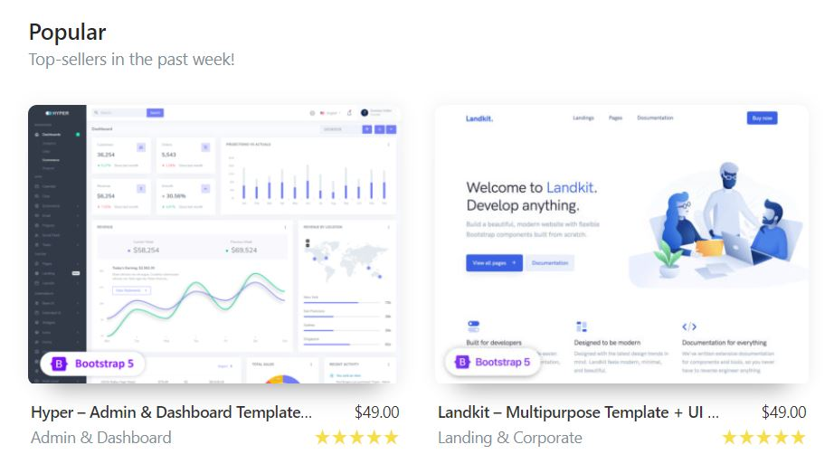

# Bootstrap

* 반응형 웹사이트를 쉽게 만들 수 있게 도와주는 HTML, CSS, JS 프레임워크
* 하나의 CSS로 휴대폰, 태블릿, 데스크탑까지 다양한 기기에서 작동
* 상업적 용도 또한 무료로 사용 가능한 오픈 소스

#### Download Link : https://getbootstrap.com/

* 위 링크에서 다운로드 가능

 

### Grid system

* 하나의 행을 12개의 열로 나눌 수 있음
* 브라우저의 크기에 따라 반응형으로 크기를 조절 가능
* ex ) [bootstrap1.html](https://github.com/moonbaaang/Bootstrap/blob/main/bootstrap1.html)

### Component

* Alert / Badges / Buttons 등 페이지 구성에 있어 유용한 아이템들의 기본 사용 형태 정의

* Primary, Secondary, Success, Danger, Warning, Info 등 기본 색상 및  사용 형태 지정

 

## Examples

* 사용 예시가 나열 되어있음

 

## Icon

* 웹 페이지 작성 시 필요한 아이콘을 사용 가능

 

# Themes

* ANGULAR / Vue.js / REACT.js 등의 버전도 제공하는 경우가 많음

 
